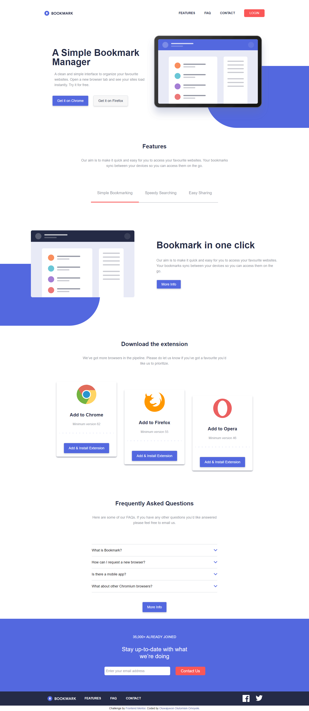

# Frontend Mentor - Bookmark landing page solution

This is a solution to the [Bookmark landing page challenge on Frontend Mentor](https://www.frontendmentor.io/challenges/bookmark-landing-page-5d0b588a9edda32581d29158). Frontend Mentor challenges help you improve your coding skills by building realistic projects. 

## Table of contents

- [Overview](#overview)
  - [The challenge](#the-challenge)
  - [Screenshot](#screenshot)
  - [Links](#links)
- [My process](#my-process)
  - [Built with](#built-with)
  - [Continued development](#continued-development)
  - [Useful resources](#useful-resources)

## Overview

The Bookmark landing page is a project i worked on with html, tailwindcss and vanilla javascript, vanilla javascript for the navigation bar mobile view toggle functionality, animated tab slider and also form vaildation.

### The challenge

Users should be able to:

- View the optimal layout for the site depending on their device's screen size
- See hover states for all interactive elements on the page
- Receive an error message when the newsletter form is submitted if:
  - The input field is empty
  - The email address is not formatted correctly

### Screenshot

### Links

- Solution URL: [Solution page on FrontendMentor](https://www.frontendmentor.io/challenges/bookmark-landing-page-5d0b588a9edda32581d29158/hub/bookmark-landing-page-using-ntailwindcss-desktopfirst-approach-A2PaFqlvf)
- Live Site URL: [Live Site](https://oluwajuwonomoyele.github.io/bookmark/)

## My process

This is my first project i worked on using tailwindcss. Using tailwincss it's always a mobile first workflow but i took the desktop first apprroach as i found it easier to implement. I used a week to complete this project, has to be one of my longest projects. I was a fun ride anyway.

### Built with

- Semantic HTML5 markup
- CSS custom properties
- Flexbox
- CSS Grid
- Mobile-first workflow
- [Tailwind](https://tailwindcss.com) - CSS framework

### Continued development
For future and continued development, i'll do more projects with tailwindcss as it is a fun approach to styling your html page.

### Useful resources

- [TailwindCSS](https://tailwindcss.com) - This helped me as a guide in search for utility classes associated with tailwindcss

## Author

- Frontend Mentor -  [@Oluwajuwonomoyele](https://www.frontendmentor.io/profile/Oluwajuwonomoyele)
- Twitter - [@OlutomisinJuwon](https://twitter.com/OlutomisinJuwon)

